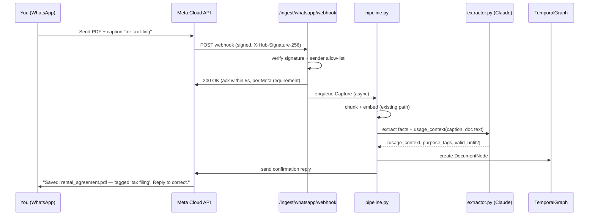

# TRD — 2ndBrain: WhatsApp Capture & Usage-Context Memory

Companion to `02-prd.md`. This document specifies *how* to build it, in the same style and stack as the existing repo (FastAPI, Pydantic settings, NetworkX graph, ChromaDB, Claude tool-calling, NiceGUI) — no new frameworks introduced.

---

## 1. Updated Architecture

The existing five layers stay exactly as they are. WhatsApp is added as a new **Capture** adapter, and one new node type is added to the **Memory Store** layer.

```
┌─────────────────────────────────────────────────────────┐
│  Capture          markdown | pdf | url-clip | WhatsApp ⭐│
├─────────────────────────────────────────────────────────┤
│  Enrichment      chunk → embed → extract                │
│                   ⭐ + purpose/usage-context extraction   │
├─────────────────────────────────────────────────────────┤
│  Memory Store    Episodic | Semantic (facts) |           │
│                   ⭐ Semantic (Document nodes) | Community│
├─────────────────────────────────────────────────────────┤
│  Retrieval       Dense + BM25 + Graph (RRF)              │
│                   ⭐ + purpose-tag boosting               │
├─────────────────────────────────────────────────────────┤
│  Surface & Act   Contradictions, resurfacing, digests    │
│                   ⭐ + WhatsApp push channel              │
└─────────────────────────────────────────────────────────┘
```

## 2. New Data Model

### 2.1 `Document` graph node (new, alongside existing `Fact`)

```python
# backend/memory/graph.py — new node kind, same TemporalGraph interface

@dataclass
class DocumentNode:
    id: str                      # uuid
    title: str                   # inferred or user-given filename/subject
    source_channel: str          # "whatsapp" | "markdown" | "pdf" | "url"
    source_message_id: str | None  # WhatsApp wamid, for idempotency
    episodic_ref: str            # id of the underlying Chroma/episodic chunk(s)
    usage_context: str           # free text: "what is this for"
    purpose_tags: list[str]      # e.g. ["tax", "finance"]
    valid_from: datetime         # when this understanding of the doc became true
    valid_to: datetime | None    # bi-temporal — set on correction/supersede
    valid_until: datetime | None # when the DOCUMENT ITSELF stops being relevant (expiry/deadline)
    recorded_at: datetime        # when the system learned it
    superseded_by: str | None    # same pattern as existing Fact supersession
```

This deliberately reuses the *exact same bi-temporal supersede pattern* already implemented for `Fact` nodes (`valid_to` + `superseded_by`) — a corrected `usage_context` doesn't overwrite history, it closes the old node and links to a new one, consistent with the project's existing design decision.

### 2.2 `Capture` dataclass — one new optional field

```python
# backend/ingestion/base.py
@dataclass
class Capture:
    source_type: str
    raw_content: bytes | str
    caption: str | None = None        # ⭐ new: WhatsApp caption text, if any
    sender_message_id: str | None = None  # ⭐ new: for idempotency/dedup
    received_at: datetime = field(default_factory=utcnow)
    # ...existing fields unchanged
```

## 3. New Ingestion Adapter

```python
# backend/ingestion/whatsapp.py
from backend.ingestion.base import IngestionAdapter, Capture

class WhatsAppAdapter(IngestionAdapter):
    """
    Turns an inbound WhatsApp Cloud API webhook payload into a Capture,
    the same contract markdown.py and pdf.py already implement.
    """

    def __init__(self, client: "WhatsAppClient"):
        self.client = client

    def parse_webhook_event(self, payload: dict) -> list[Capture]:
        captures = []
        for entry in payload.get("entry", []):
            for change in entry.get("changes", []):
                for msg in change.get("value", {}).get("messages", []):
                    if msg["type"] not in ("document", "image"):
                        continue  # ignore plain text chit-chat for now
                    media_id = msg[msg["type"]]["id"]
                    raw_bytes = self.client.download_media(media_id)
                    captures.append(Capture(
                        source_type="whatsapp",
                        raw_content=raw_bytes,
                        caption=msg[msg["type"]].get("caption"),
                        sender_message_id=msg["id"],
                    ))
        return captures
```

This is intentionally thin: it does not duplicate PDF parsing logic. A `document` capture with a PDF mimetype is handed to the *existing* `pdf.py` extraction path once downloaded — the adapter's only job is "get bytes out of WhatsApp," matching the single-responsibility style of the current `ingestion/` package.

## 4. Sequence: Capture → Confirmation



## 5. API Additions

| Method | Endpoint | Description |
|---|---|---|
| `GET` | `/ingest/whatsapp/webhook` | Meta's webhook verification handshake (`hub.challenge` echo) |
| `POST` | `/ingest/whatsapp/webhook` | Inbound message events (documents, images, and correction replies) |
| `GET` | `/documents` | List `DocumentNode`s, filterable by `purpose_tags`, sorted by `valid_until` |
| `POST` | `/documents/{id}/correct` | Manual correction of `usage_context` (used by both UI and WhatsApp-reply flow) |
| `GET` | `/documents/expiring` | Documents whose `valid_until` falls within N days — feeds the resurfacing job |

## 6. WhatsApp Setup (official, free, single-user path)

1. Create a Meta developer app → add the **WhatsApp** product. Meta provisions a **free test phone number** automatically — no business verification needed for personal/dev use.
2. Under the test number's settings, add **your own personal phone number** to the allow-list of recipients (free tier permits a small number of allow-listed testers — one is enough).
3. Generate a temporary (or, for stability, a System User permanent) access token and note the **Phone Number ID**.
4. Set environment variables (same `BRAIN_*` naming convention as the existing config):
   - `BRAIN_WHATSAPP_ACCESS_TOKEN`
   - `BRAIN_WHATSAPP_PHONE_NUMBER_ID`
   - `BRAIN_WHATSAPP_VERIFY_TOKEN` (a string you choose, used only in the handshake)
   - `BRAIN_WHATSAPP_APP_SECRET` (used to verify `X-Hub-Signature-256` on every webhook call)
   - `BRAIN_WHATSAPP_ALLOWED_SENDER` (your own WhatsApp number — every inbound message from any other number is dropped)
5. Expose the FastAPI app's `/ingest/whatsapp/webhook` route over HTTPS (a small VPS, or a tunnel such as ngrok/Cloudflare Tunnel for local dev) and register that URL + verify token in the Meta app dashboard.
6. Send yourself a document on WhatsApp → it should reach the webhook within seconds.

This path has **no ban risk** and **no cost** at this volume, because you are only receiving messages you send to yourself and replying to yourself — it never automates outbound messaging to third parties, which is the behavior Meta's enforcement actually targets.

## 7. Security Requirements (launch-blocking, not optional)

| Requirement | Implementation |
|---|---|
| Webhook authenticity | Verify `X-Hub-Signature-256` HMAC using `BRAIN_WHATSAPP_APP_SECRET` on every POST before processing. |
| Sender allow-list | Drop any inbound message whose `from` number ≠ `BRAIN_WHATSAPP_ALLOWED_SENDER`. |
| Idempotency | Dedupe on WhatsApp's `wamid` (message id) — store processed ids, ignore Meta's retried deliveries. |
| Credentials | Replace the documented default `admin`/`changeme` before any webhook is made publicly reachable; require `BRAIN_AUTH_PASSWORD_HASH` to be explicitly set (fail startup if still default and `BRAIN_AUTH_ENABLED=true` on a non-localhost bind). |
| Encryption at rest | Encrypt the raw document blob store (whatever holds original PDFs/images) with a local key (e.g., `cryptography.fernet`) derived from an env-provided passphrase — episodic text embeddings are lower-risk, but original documents (IDs, medical, financial) are not. |
| Network exposure | Recommend binding the API to localhost + a Tailscale/private-tunnel path for personal use, rather than a raw public port, with the webhook endpoint as the only path deliberately exposed publicly (via reverse proxy). |
| No silent deletion | Corrections use the existing supersede pattern — nothing is ever hard-deleted, consistent with the project's core bi-temporal design decision. |

## 8. Non-Functional Requirements

- **Latency:** webhook handler must return `200 OK` to Meta within 5 seconds (Meta requirement) — heavy work (embedding, LLM extraction) happens on a background task/queue, not inline in the request handler.
- **Reliability:** Meta retries undelivered webhooks; idempotency (§7) must make retries safe/no-op.
- **Cost:** Meta Cloud API is free at this volume (personal, low message count, allow-listed test number); the only marginal cost is the Claude API extraction call per document, consistent with the existing `BRAIN_ANTHROPIC_API_KEY`-gated extraction feature.
- **Portability:** the `IngestionAdapter` interface must remain channel-agnostic — swapping WhatsApp for Telegram later should only require a new adapter class, not changes to `pipeline.py`.

## 9. Testing Additions

- Unit tests for `WhatsAppAdapter.parse_webhook_event` against recorded sample Meta payloads (documents, images, text-only messages to be ignored, correction replies).
- Signature-verification tests (valid signature accepted, tampered payload rejected, missing header rejected).
- Idempotency test: same `wamid` delivered twice → only one `DocumentNode` created.
- New eval category in `golden_set.py`: **usage-context recall**, scored the same way as existing categories (see Research Paper §7).

## 10. Rollout Gate

Do **not** send real financial/ID/medical documents through the webhook until §7 (Security Requirements) is fully implemented and verified — start the rollout with low-sensitivity documents (e.g., a grocery list PDF, a meeting note) to validate the pipeline end-to-end first.
