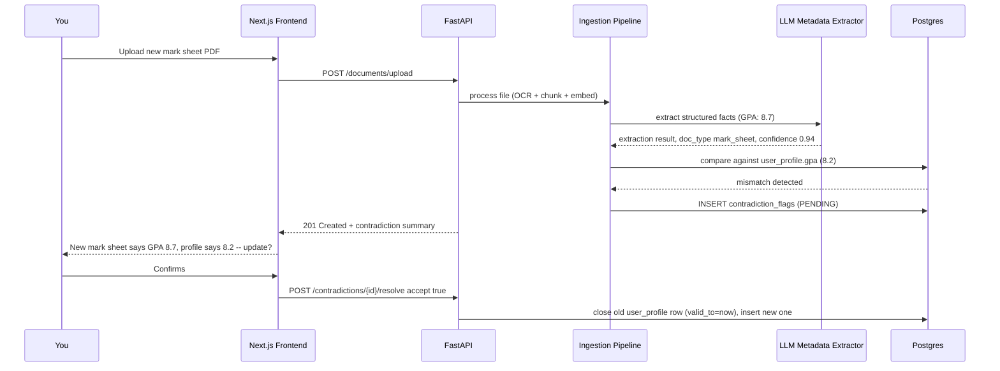

# TRD — Personal AI Second Brain (React Frontend)

Companion to `07-prd.md`. Backend architecture follows the research paper's 3-tier design; this document adds full detail on the two things the paper leaves open — the concrete frontend (you asked for React) and the schema/API changes needed for the new features in `06-additional-features.md`.

---

## 1. Updated High-Level Architecture

```
┌───────────────────────────────────────────────────────────────────┐
│  FRONTEND — Next.js 15 (App Router) + TypeScript + Tailwind        │
│  Dashboard | Documents | Timeline | Graph | Chat | Settings        │
└───────────────────────────────────────────────────────────────────┘
                                │  REST + SSE (streaming chat)
                                ▼
┌───────────────────────────────────────────────────────────────────┐
│  API & ROUTING LAYER — FastAPI                                    │
│  /profile  /documents  /query  /timeline  /reminders  /graph       │
└───────────────────────────────────────────────────────────────────┘
        │                                    │
        ▼                                    ▼
┌───────────────────────────┐   ┌───────────────────────────────────┐
│ PERSONAL MEMORY MODULE     │   │ DOCUMENT INGESTION ENGINE          │
│ Postgres (bi-temporal)     │   │ OCR + Chunker + Embedder           │
│                             │   │ ⭐ WhatsApp / email adapters        │
└───────────────────────────┘   └───────────────────────────────────┘
        │                                    │
        ▼                                    ▼
┌───────────────────────────────────────────────────────────────────┐
│  STORAGE LAYER                                                     │
│  Postgres (structured, bi-temporal, field-encrypted columns)       │
│  Vector DB: ChromaDB / Qdrant                                      │
│  Object storage: local encrypted vault (AES-256)                   │
└───────────────────────────────────────────────────────────────────┘
                                │
                                ▼
┌───────────────────────────────────────────────────────────────────┐
│  INTELLIGENCE LAYER                                                │
│  Intent classifier → SQL / Vector / Hybrid                         │
│  ⭐ Privacy router: sensitive category → local (Ollama),            │
│                     else → cloud (Claude)                          │
│  ⭐ Contradiction detector · ⭐ Reminder/digest scheduler            │
└───────────────────────────────────────────────────────────────────┘
```

## 2. Frontend Architecture (React / Next.js)

### 2.1 Stack

| Concern | Choice | Why |
|---|---|---|
| Framework | **Next.js 15, App Router** | Server Components by default cut shipped JS substantially versus the legacy Pages Router, and Server Actions give a clean way to call the FastAPI backend without hand-rolled fetch boilerplate everywhere. |
| Language | TypeScript | Type-safe contracts against the FastAPI OpenAPI schema (generated client, see §2.4). |
| Styling | Tailwind CSS + shadcn/ui | Matches the research paper's own recommended stack; shadcn gives accessible, unstyled-by-default primitives rather than a heavy component library to fight against. |
| Server state | TanStack Query | Caching/retry/invalidation for all `/api/*` calls (documents list, profile, timeline). |
| Client/UI state | Zustand | Small, explicit stores for things that aren't server data (command palette open/closed, active chat thread, theme). |
| Realtime chat | Server-Sent Events (SSE) | Simpler than WebSockets for one-directional token streaming from the RAG endpoint; no bidirectional need here. |
| Auth | WebAuthn (`@simplewebauthn/browser`) + NextAuth session cookie | Passkey-first login per PRD §6, PIN as an explicit lower-trust fallback. |
| PWA | `next-pwa` / native App Router manifest + service worker | Installable home-screen app per PRD "Non-Goals" (web-installable, not native). |

### 2.2 Route / Page Structure (App Router)

```
app/
├── (auth)/
│   ├── login/page.tsx              # WebAuthn + PIN fallback
│   └── layout.tsx
├── (app)/
│   ├── layout.tsx                  # shell: sidebar nav + command palette provider
│   ├── dashboard/page.tsx          # life timeline feed + upcoming reminders
│   ├── profile/page.tsx            # identity, education, editable fields (bi-temporal aware)
│   ├── family/page.tsx             # relationship graph (force-directed) + list fallback
│   ├── documents/
│   │   ├── page.tsx                # vault: filter by category, expiry status chips
│   │   └── [id]/page.tsx           # document viewer + inline highlight + usage/expiry panel
│   ├── goals/page.tsx              # goals + check-in history
│   ├── chat/page.tsx               # conversational query interface (SSE streaming)
│   └── settings/
│       ├── security/page.tsx       # passkeys, audit log, data export
│       └── integrations/page.tsx   # WhatsApp/email capture status, calendar sync
└── api/
    └── auth/[...nextauth]/route.ts
```

### 2.3 Key Components

| Component | Responsibility |
|---|---|
| `<CommandPalette />` | Global `Cmd/Ctrl+K` overlay — quick capture (paste text/paste a document) or jump-to-search, backed by the same `/query` endpoint used by chat. |
| `<TimelineFeed />` | Chronological render of `timeline_events` + document key-dates + goal check-ins, virtualized for long histories. |
| `<RelationshipGraph />` | Force-directed graph (e.g., `react-force-graph` or `d3-force` directly) over the `family_members`/relations edges; falls back to a simple list on small viewports. |
| `<DocumentViewer />` | Renders the original PDF/image (via `pdf.js`) with the ability to scroll to and highlight the span a chat answer cited. |
| `<ChatThread />` | Streams tokens via SSE from `/query`, renders inline source-document citations as clickable chips that deep-link into `<DocumentViewer />`. |
| `<ExpiryBadge />` | Small status chip (green/amber/red) shared between the dashboard, document cards, and settings — single source of the "how urgent" visual language. |

### 2.4 API Contract Generation

FastAPI already emits an OpenAPI schema; generate a typed TypeScript client (`openapi-typescript` + a thin fetch wrapper, or `orval`) as part of the build, so frontend and backend never silently drift out of sync on request/response shapes — no hand-maintained duplicate types.

## 3. Backend Schema Additions

Building on the research paper's existing `user_profile`, `family_members`, `personal_goals`, `timeline_events`, `documents` tables:

```sql
-- Bi-temporal columns added to every mutable profile-style table
ALTER TABLE user_profile   ADD COLUMN valid_from TIMESTAMP DEFAULT now();
ALTER TABLE user_profile   ADD COLUMN valid_to   TIMESTAMP;
ALTER TABLE personal_goals ADD COLUMN valid_from TIMESTAMP DEFAULT now();
ALTER TABLE personal_goals ADD COLUMN valid_to   TIMESTAMP;
-- (same pair added to family_members)

-- Relationship graph edges (replaces the implicit "family_members is a flat list" assumption)
CREATE TABLE relationships (
    id UUID PRIMARY KEY,
    person_a_id UUID REFERENCES family_members(id),
    person_b_id UUID REFERENCES family_members(id),
    relation_type VARCHAR(50),          -- "introduced_by", "coworker_of", "sibling_of"
    valid_from TIMESTAMP DEFAULT now(),
    valid_to TIMESTAMP
);

-- Document key dates (expiry/renewal tracking)
ALTER TABLE documents ADD COLUMN key_dates JSONB;          -- {"expires_on": "...", "renew_by": "..."}
ALTER TABLE documents ADD COLUMN confidence_score FLOAT;   -- LLM categorization confidence
ALTER TABLE documents ADD COLUMN source_channel VARCHAR(30) DEFAULT 'upload'; -- upload|whatsapp|email

-- Contradiction / review queue
CREATE TABLE contradiction_flags (
    id UUID PRIMARY KEY,
    document_id UUID REFERENCES documents(id),
    profile_table VARCHAR(50),     -- e.g. "user_profile"
    profile_field VARCHAR(50),     -- e.g. "gpa"
    existing_value TEXT,
    proposed_value TEXT,
    status VARCHAR(20) DEFAULT 'PENDING', -- PENDING | ACCEPTED | REJECTED
    created_at TIMESTAMP DEFAULT now()
);

-- Reminder feed (goals, document expiries, birthdays — unified)
CREATE TABLE reminders (
    id UUID PRIMARY KEY,
    source_type VARCHAR(30),        -- "goal" | "document" | "birthday"
    source_id UUID,
    title VARCHAR(200),
    remind_on DATE,
    dismissed BOOLEAN DEFAULT false
);

-- Append-only audit log
CREATE TABLE audit_log (
    id UUID PRIMARY KEY,
    action VARCHAR(50),             -- "query" | "view_document" | "edit_profile"
    target_id UUID,
    query_text TEXT,
    created_at TIMESTAMP DEFAULT now()
);
```

Field-level encryption: government-ID-number and financial-account fields are stored via an application-layer encryption wrapper (e.g., `pgcrypto`'s `pgp_sym_encrypt`, keyed from an env-provided passphrase) rather than plain columns — encrypted at the application boundary, not just at the disk/volume level.

## 4. API Endpoints (additions to the research paper's implied REST surface)

| Method | Endpoint | Description |
|---|---|---|
| `GET` | `/profile` | Current (non-expired, `valid_to IS NULL`) profile fields |
| `GET` | `/profile/history?field=current_address` | Bi-temporal history of one field |
| `POST` | `/query` | Hybrid query endpoint (SSE stream response), implements the paper's `process_user_query` |
| `GET` | `/documents?category=&expiring_within=` | Vault listing with filters |
| `GET` | `/documents/{id}` | Document detail incl. `key_dates`, `confidence_score` |
| `POST` | `/documents/upload` | Direct upload path |
| `POST` | `/ingest/whatsapp/webhook` | WhatsApp capture channel (see extensions §2) |
| `POST` | `/ingest/email` | Inbound email-forward capture (via provider webhook, e.g. Postmark/SendGrid inbound parse) |
| `GET` | `/contradictions?status=PENDING` | Review queue for auto-detected mismatches |
| `POST` | `/contradictions/{id}/resolve` | Accept or reject a proposed profile update |
| `GET` | `/reminders?window_days=30` | Unified upcoming-reminders feed |
| `GET` | `/graph/relationships` | Relationship graph edges for `<RelationshipGraph />` |
| `GET` | `/audit-log` | Access history |
| `GET` | `/export` | Full data export (JSON + original files, zipped) |

## 5. Sequence: Contradiction Detection on Ingest



## 6. Privacy-Tiered LLM Routing

```python
SENSITIVE_CATEGORIES = {"identity", "medical", "financial"}

def route_llm(document_category: str, query_context: dict):
    if document_category in SENSITIVE_CATEGORIES:
        return local_llm_client   # Ollama - never leaves the machine
    return cloud_llm_client       # Claude - used for general/non-sensitive queries
```

This is enforced at the retrieval layer, not just as a UI toggle — a query whose retrieved context includes any sensitive-category chunk is always answered locally, even if the query text itself looks innocuous.

## 7. Non-Functional Requirements

- **Latency:** SQL-path queries < 1s; hybrid/RAG queries < 3s end-to-end, including local-LLM cases (validate local model choice against this budget — see PRD Risks).
- **Streaming UX:** chat responses stream token-by-token over SSE so perceived latency stays low even when total generation takes the full 3-second budget.
- **Idempotent ingestion:** WhatsApp/email adapters dedupe on provider message ID, matching the pattern used for any webhook-based capture channel.
- **Data integrity:** no `UPDATE` ever hard-overwrites a bi-temporal field; all changes go through close-old/insert-new.
- **Portability:** `/export` must produce a complete, human-readable archive with no proprietary lock-in.

## 8. Deployment

| Environment | Notes |
|---|---|
| **Local-first (recommended default)** | Next.js + FastAPI + Postgres + Chroma/Qdrant + Ollama all on one machine or home server; no data leaves the LAN except cloud-LLM calls for non-sensitive queries. |
| **Small VPS (optional)** | Same stack, behind a reverse proxy with HTTPS, needed only if WhatsApp/email webhook capture channels require a public endpoint; database and object storage still local/private-network only. |
| **Secrets** | All API keys (Claude, WhatsApp, email-inbound provider) via environment variables, never committed; encryption passphrase supplied at process start, never stored alongside the data it protects. |

## 9. Testing

- Component tests (Vitest + React Testing Library) for `<ChatThread />` streaming rendering, `<ExpiryBadge />` status logic, and command palette keyboard interactions.
- API contract tests generated from the OpenAPI schema to catch frontend/backend drift automatically.
- Contradiction-detection golden set: a fixed set of "new document vs. existing profile" pairs with known expected flags, run on every backend change.
- End-to-end (Playwright): login (WebAuthn) -> upload document -> see it categorized -> ask a chat question that cites it -> click citation -> confirm `<DocumentViewer />` highlights the right span.
